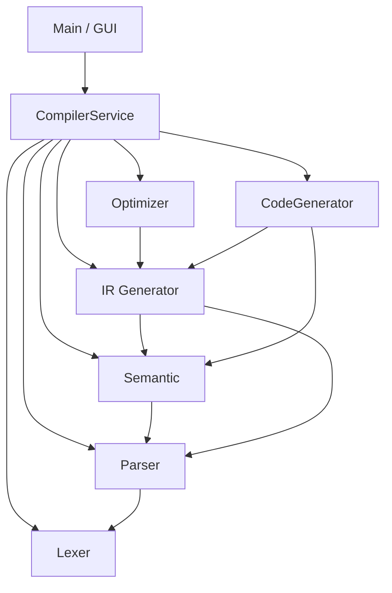

# 简易编译器项目 (Simple Compiler)

## 1. 项目简介
本项目是一个基于 Java 实现的简易编译器，采用**分层架构**和**门面模式**设计。支持从源代码到目标伪汇编代码的全流程编译，包括词法分析、语法分析、语义分析、中间代码生成、代码优化和目标代码生成。

## 2. 架构设计

项目采用严格的**门面模式 (Facade Pattern)**，每个核心模块（包）对外只暴露一个公共类，内部实现细节完全封装。

### 模块依赖关系


## 3. 模块说明

| 模块 | 包路径 | 门面类 | 职责 |
| :--- | :--- | :--- | :--- |
| **词法分析** | `com.zds.lexer` | `Lexer` | 将源代码转换为 Token 序列 |
| **语法分析** | `com.zds.parser` | `Parser` | 将 Token 序列转换为抽象语法树 (AST) |
| **语义分析** | `com.zds.Semantic` | `Semantic` | 类型检查、作用域管理、符号表构建 |
| **中间代码** | `com.zds.IR` | `IR` | 生成三地址码（四元式） |
| **代码优化** | `com.zds.optimizer` | `Optimizer` | 常量折叠、代数化简、死代码消除 |
| **代码生成** | `com.zds.codegen` | `CodeGen` | 生成目标伪汇编指令 |
| **服务层** | `com.zds.service` | `CompilerService` | 串联整个编译流水线 |

## 4. 快速开始

### 环境要求
- JDK 11+
- Maven / Gradle (可选，当前为纯 Java 项目结构)

### 运行方式
项目提供了 GUI 界面和命令行两种运行方式。

1. **GUI 模式** (默认):
   直接运行 `com.zds.main.Main` 类。

2. **命令行模式**:
   ```bash
   java com.zds.main.Main cli
   ```
   将读取 `src/main/resources/input.txt` 并输出编译结果到控制台。

## 5. 文档索引
每个模块都有详细的内部实现文档，请参阅各包下的 `README.md`：
- [Lexer 文档](src/main/java/com/zds/lexer/README.md)
- [Parser 文档](src/main/java/com/zds/parser/README.md)
- [Semantic 文档](src/main/java/com/zds/Semantic/README.md)
- [IR 文档](src/main/java/com/zds/IR/README.md)
- [Optimizer 文档](src/main/java/com/zds/optimizer/README.md)
- [CodeGen 文档](src/main/java/com/zds/codegen/README.md)
- [Service 文档](src/main/java/com/zds/service/README.md)
